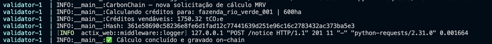

# CarbonChain

Plataforma brasileira de créditos de carbono com MRV auditável on-chain via Cartesi.

## O que é

Conecta produtores rurais brasileiros ao mercado global de créditos de carbono usando:
- **Satélite Sentinel-2** para análise NDVI e mapeamento de zonas
- **Sensor NIR** para medição de carbono orgânico no solo (SOC)
- **Metodologia Verra VM0042 v2.1** para cálculo dos créditos
- **Cartesi Rollup** para execução auditável e verificável on-chain

## Diferencial técnico

O cálculo VM0042 roda dentro de uma máquina Linux verificável (RISC-V) via Cartesi.
O resultado é gravado on-chain com hash único — qualquer auditor pode re-executar
o cálculo e verificar que o hash bate. Nenhum projeto de carbono faz isso hoje.

## Prova de execução



Hash de exemplo:
`361e58690c58236e8fe6d1fad12c77441639d251e96c16c2783432ac373ba5e3`

## Estrutura
```
mrv/
  satellite.py   # Análise NDVI via Sentinel-2
  vm0042.py      # Cálculo de créditos carbono (Verra VM0042)
cartesi/
  dapp/carbonchain-mrv/
    dapp.py      # MRV on-chain com hash auditável
data/
  sample_farm/
    mapa_ndvi.png           # Mapa NDVI — Rio Verde/GO
    resultado_vm0042.json   # Resultado do cálculo
```

## Stack

Python · Sentinel-2 · Verra VM0042 · Cartesi Rollup · RISC-V

## Status

Parte 1 completa — build técnico local funcional.
Próximo: deploy em testnet pública (Arbitrum Sepolia).
